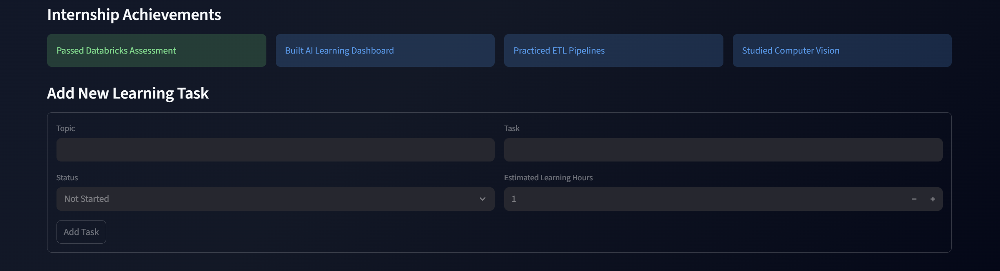
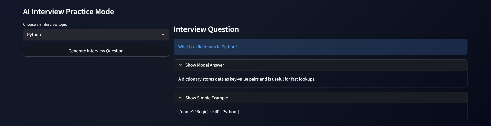

# AI Internship Learning Tracker

An interactive AI-powered internship learning dashboard built with Streamlit, Pandas, and Plotly.

## Live Demo

[Open Live App](https://ai-internship-learning-trackergit-6dbpkrdrsgn7yg2d6leki4.streamlit.app/)

---

## Features

- Add and manage learning tasks
- Track progress and learning hours
- Interactive analytics dashboard
- AI-powered study coach
- AI interview practice mode
- Topic filtering system
- Persistent CSV data storage
- Streamlit web interface
- Interactive Plotly charts

---

## Tech Stack

- Python
- Streamlit
- Pandas
- Plotly
- Git & GitHub

---

## AI Features

### AI Study Coach
Generates local AI-based study plans using learning progress data.

### AI Interview Practice Mode
Provides:
- Internship-style technical questions
- Model answers
- Simple explanations
- Multiple learning topics

Topics include:
- Python
- SQL
- Machine Learning
- Deep Learning
- Cloud Computing
- Databricks

---

## Screenshots

## Screenshots

### Dashboard Overview



---

### AI Interview Practice Mode



---

## Run Locally

Clone the repository:

```bash
git clone https://github.com/beqooo09/ai-internship-learning-tracker.git


Install dependencies:
pip install -r requirements.txt

Run the app:
python -m streamlit run app.py

Future Improvements:

Edit/Delete tasks
Authentication system
User accounts
Real OpenAI API integration
Machine learning predictions
Weekly progress tracking
Database integration

Author

Built by Beqir as part of AI/Data internship preparation.
=======
# AI Internship Learning Tracker

An interactive AI-powered internship learning dashboard built with Streamlit, Pandas, and Plotly.

## Live Demo

[Open Live App](https://ai-internship-learning-trackergit-6dbpkrdrsgn7yg2d6leki4.streamlit.app/)

---

## Features

- Add and manage learning tasks
- Track progress and learning hours
- Interactive analytics dashboard
- AI-powered study coach
- AI interview practice mode
- Topic filtering system
- Persistent CSV data storage
- Streamlit web interface
- Interactive Plotly charts

---

## Tech Stack

- Python
- Streamlit
- Pandas
- Plotly
- Git & GitHub

---

## AI Features

### AI Study Coach
Generates local AI-based study plans using learning progress data.

### AI Interview Practice Mode
Provides:
- Internship-style technical questions
- Model answers
- Simple explanations
- Multiple learning topics

Topics include:
- Python
- SQL
- Machine Learning
- Deep Learning
- Cloud Computing
- Databricks

---

## Screenshots

.

---

## Run Locally

Clone the repository:

```bash
git clone https://github.com/beqooo09/ai-internship-learning-tracker.git


Install dependencies:
pip install -r requirements.txt

Run the app:
python -m streamlit run app.py

Future Improvements:

Edit/Delete tasks
Authentication system
User accounts
Real OpenAI API integration
Machine learning predictions
Weekly progress tracking
Database integration

Author

Built by Beqir Bytyci as part of  internship preparation.

